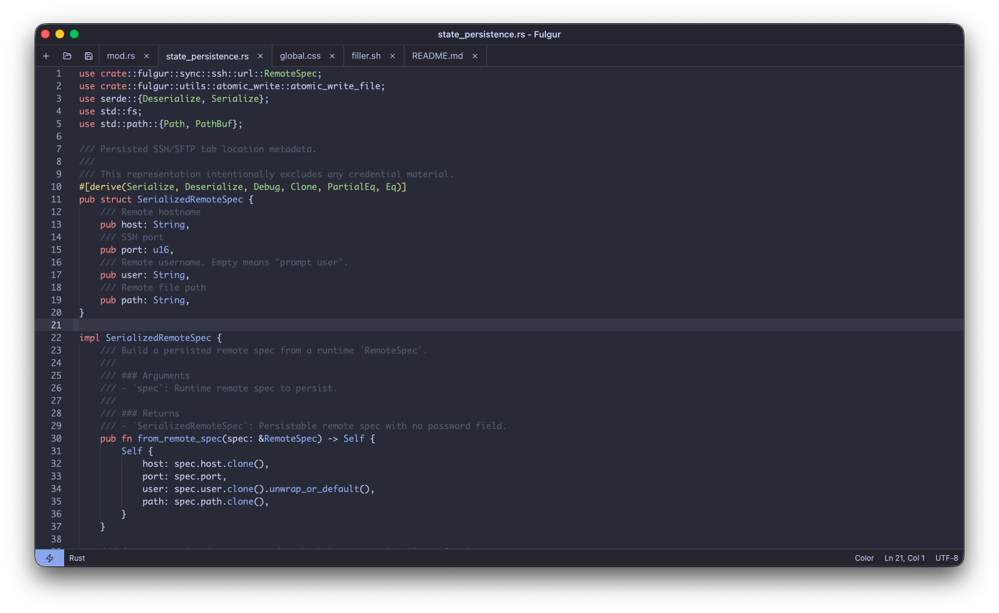
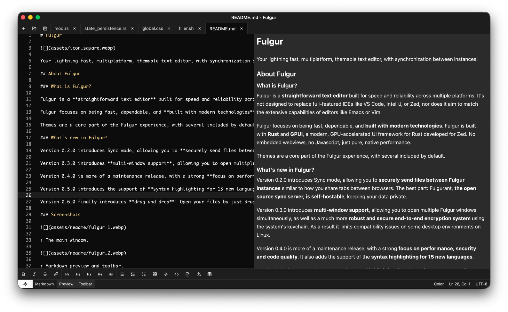
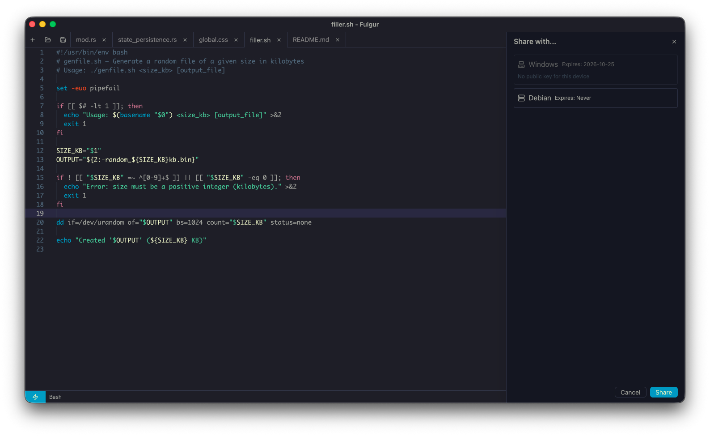
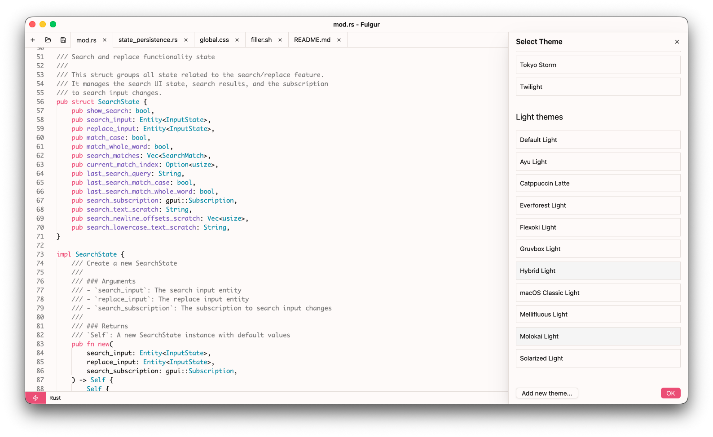
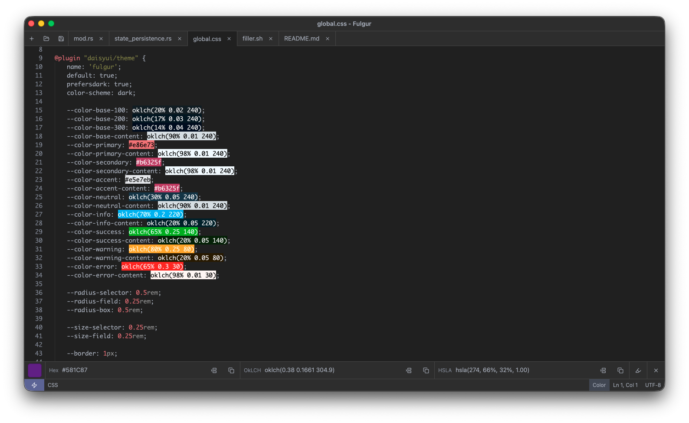
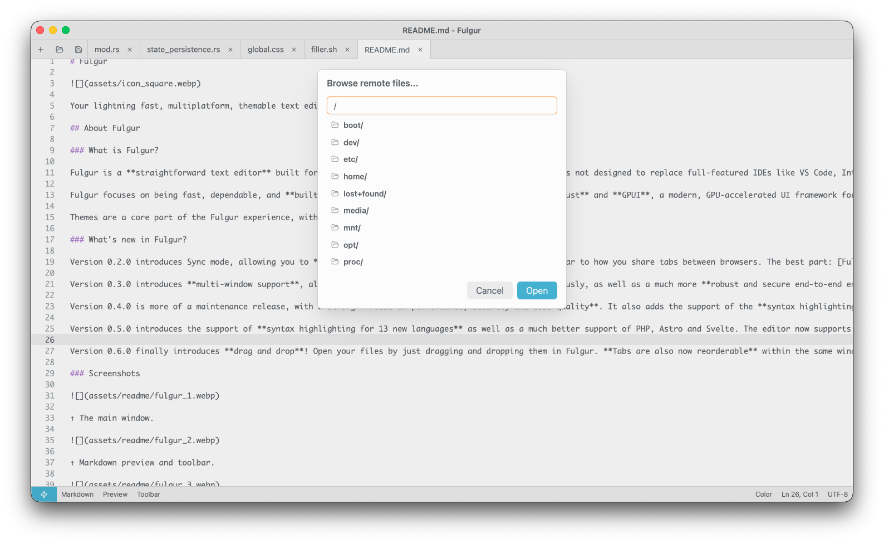

<div align="center">


# Fulgur

**A lightning-fast, native text editor with end-to-end encrypted sync you can self-host.**

Built in Rust on [GPUI](https://www.gpui.rs/), the GPU-accelerated UI framework powering Zed. No webviews, no JavaScript, pure speed.

[](https://github.com/fulgur-app/Fulgur/releases/latest)
[](https://github.com/fulgur-app/Fulgur/actions/workflows/ci.yml)
[](LICENCE)
[](#install)
[](https://discord.gg/dMGy49JqRD)

[Website](https://fulgur.app) · [Download](#install) · [Discord](https://discord.gg/dMGy49JqRD) · [Sync server](https://github.com/fulgur-app/fulgurant) · [Releases](https://github.com/fulgur-app/Fulgur/releases)



</div>

## Why Fulgur?

Sometimes you don't want an IDE. You want to open a file *now*, edit it, and get on with your day, without a splash screen, a plugin marketplace, or a gigabyte of RAM held hostage. That's Fulgur:

- **Actually native.** Rust + GPUI rendering straight to the GPU. Instant startup, instant typing, on macOS, Windows, and Linux.
- **Sync without the cloud landlord.** Send files between your machines like browser tabs, end-to-end encrypted, through [Fulgurant](https://github.com/fulgur-app/fulgurant), an open source sync server you can self-host. The server never sees your plaintext.
- **Power-user comforts, zero configuration.** Syntax highlighting for 60+ languages, SSH remote editing, CSV table view, live log following, Markdown preview, all out of the box.

Fulgur doesn't try to replace VS Code, Zed, or Vim. It's the fast, dependable editor you reach for the other fifty times a day.

## Features

### Editing
- **Syntax highlighting for 60+ languages** via tree-sitter, with code folding
- **Markdown preview** in a side tab, with a formatting toolbar
- **CSV mode**: opens CSV files as an editable table
- **LOG mode**: follows log files in real time as your app writes them
- **Color tools**: a color picker and converter bar, plus inline color previews in your code
- **Search**, jump to line, drag-and-drop files and reorderable tabs

### Sync and remote
- **End-to-end encrypted file sharing** between your devices: X25519 keys per device (stored in the system keychain), encryption via [age](https://github.com/FiloSottile/age), zero-knowledge server
- **Self-hostable sync server**: [Fulgurant](https://github.com/fulgur-app/fulgurant) is open source; run your own, or several at once (e.g. personal + work)
- **Edit files over SSH** directly on remote servers, with an integrated file browser
- **File watching**: files changed on disk reload automatically, with conflict handling for unsaved edits

### Workflow
- **Multi-window** support, with tab transfer between windows
- **Themes as a core feature**: 8 bundled, JSON-based, hot-reloaded on save, and easy to write your own
- **State restoration**: windows, tabs, and even unsaved content survive restarts
- Platform niceties: macOS Dock menu, Windows taskbar jump list, signed and notarized macOS builds

## Screenshots

|  |  |
|---|---|
| Markdown preview and toolbar | Sharing a file to your devices |
|  |  |
| Theme selection | Color picker, converter, and inline color highlighting |
|  | |
| Browsing a remote server over SSH | |

## Install

Download the latest release for your platform from the [releases page](https://github.com/fulgur-app/Fulgur/releases/latest):

| Platform | Package |
|---|---|
| macOS (Apple Silicon) | `.dmg`, signed and notarized |
| Windows (x86-64) | `-setup.exe` installer |
| Linux (x86-64, aarch64) | `.AppImage` or `.deb` |

On macOS you can also install with Homebrew:

```sh
brew install --cask fulgur-app/tap/fulgur
```

On Linux, storing sync encryption keys requires a running Secret Service provider (GNOME Keyring, KWallet, or compatible). Everything else works without it.

## Themes

Fulgur themes use the `gpui-component` JSON format with hexadecimal color codes. Bundled themes (Catppuccin, Everforest, Tokyo Night, Solarized, and more) are extracted to `~/.fulgur/themes` (`%APPDATA%\Fulgur` on Windows) on first run. Edit a theme file and it hot-reloads on save; copy one to create your own.

## Self-hosted sync

Fulgur's sync is built around [Fulgurant](https://github.com/fulgur-app/fulgurant), an open source, self-hostable server. Files are gzip-compressed and encrypted per target device before they leave your machine; private keys never leave your system keychain. Connect to multiple Fulgurant instances at once and share to devices across all of them from a single panel.

## Roadmap

Fulgur is under active development. Highlights of what's coming:

- Embedded terminal
- Drag-and-drop of tabs between windows (pending upstream GPUI support)
- Continued performance work on very large files

See the [releases page](https://github.com/fulgur-app/Fulgur/releases) for what's new in each version.

## Build from source

<details>
<summary>Prerequisites and build instructions</summary>

### All platforms

[Rust](https://rust-lang.org/) 1.96.0 is the minimum supported version.

Install [cargo-packager](https://github.com/crabnebula-dev/cargo-packager) with `cargo install cargo-packager --locked`. It bundles the app with a proper icon for each platform.

Install [cargo-about](https://github.com/EmbarkStudios/cargo-about) with `cargo install cargo-about --locked`. It generates the list of third-party licenses, as required by the Apache 2.0 license's terms.

### macOS

Xcode must be installed (e.g. from the App Store) as well as the Xcode command line tools: `xcode-select --install`.

### Windows

Install the [Windows SDK](https://developer.microsoft.com/en-us/windows/downloads/sdk-archive/) matching the version of your OS and make sure that `fxd.exe` (matching your architecture e.g. x86-64, arm) is in the path.

Fulgur bundles OpenSSL for SSH remote file editing, which requires two additional build tools:

- [Strawberry Perl](https://strawberryperl.com/): needed for OpenSSL's `Configure` script
- [NASM](https://www.nasm.us/): needed for OpenSSL's assembly routines

Both must be on your `PATH` before running `cargo build`.

### Linux

**System libraries**

Fulgur stores its end-to-end encryption keys in the system keychain through the Secret Service API (GNOME Keyring, KWallet, or any compatible provider). Building the Linux version therefore requires the D-Bus development headers in addition to the usual GUI libraries.

On Ubuntu/Debian:

```sh
sudo apt install \
  libdbus-1-dev pkg-config libssl-dev \
  libxcb1-dev libxkbcommon-dev libxkbcommon-x11-dev \
  libfontconfig1-dev libfreetype6-dev \
  libxcb-render0-dev libxcb-shape0-dev libxcb-xfixes0-dev
```

On Fedora/RHEL: `sudo dnf install dbus-devel pkgconf-pkg-config openssl-devel libxcb-devel libxkbcommon-devel libxkbcommon-x11-devel fontconfig-devel freetype-devel`

On Arch: `sudo pacman -S dbus pkgconf openssl libxcb libxkbcommon libxkbcommon-x11 fontconfig freetype2`

At runtime a Secret Service provider (for example GNOME Keyring or KWallet) must be running and unlocked for synchronization key storage to work.

**Linker**

Fulgur uses `mold` as the linker on Linux to reduce memory usage during compilation. You have two options:

**Option 1: Install clang and mold**

- On Ubuntu/Debian: `sudo apt install clang mold`
- On Fedora/RHEL: `sudo dnf install clang mold`
- On Arch: `sudo pacman -S clang mold`

**Option 2: Use the default linker**

If you prefer not to install additional tools, comment out lines 8-10 in `.cargo/config.toml`:

```toml
# [target.x86_64-unknown-linux-gnu]
# linker = "clang"
# rustflags = ["-C", "link-arg=-fuse-ld=mold"]
```

Note that builds may consume more memory with the default linker, especially on systems with limited RAM.

### Build

Once all the prerequisites are installed:

- `cargo build --release` builds an optimized version of Fulgur
- `cargo packager --release` additionally packages it into a distributable with an icon

</details>

## Contributing

Contributions are welcome. See [CONTRIBUTING.md](CONTRIBUTING.md) to get started.

## License

Licensed under the [Apache License, Version 2.0](http://www.apache.org/licenses/LICENSE-2.0).

Unless required by applicable law or agreed to in writing, software distributed under the License is distributed on an "AS IS" BASIS, WITHOUT WARRANTIES OR CONDITIONS OF ANY KIND, either express or implied.
